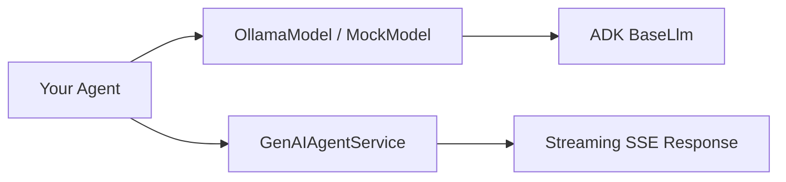

## What is ADK Utils?

ADK Utils is a TypeScript SDK that extends the [Google Agent Development Kit (ADK)](https://google.github.io/adk-docs/) with support for local and cloud-hosted Ollama models. It provides essential utilities for building AI agents that can run entirely on your local machine during development, helping you save on API costs while maintaining full compatibility with Google's ADK ecosystem.

## The Problem It Solves

Google's Agent Development Kit offers excellent support for local models in Python through the `litellm` library, but **there is no native way to use local Ollama models when working with TypeScript**. This creates a significant barrier for TypeScript developers who want to:

- Develop and test agents locally without incurring API costs
- Run agents with privacy-sensitive data that shouldn't leave their infrastructure
- Work offline or in air-gapped environments
- Prototype quickly with lightweight models before deploying to production

ADK Utils bridges this gap by providing a custom implementation of ADK's `BaseLlm` that works seamlessly with Ollama.

## Key Features

<CardGroup cols={2}>
  <Card title="OllamaModel" icon="robot">
    Custom implementation of ADK's `BaseLlm` for local and cloud-hosted Ollama models with full tool calling support
  </Card>
  
  <Card title="MockModel" icon="flask">
    Mock LLM implementation for testing and development without API costs or external dependencies
  </Card>
  
  <Card title="GenAIAgentService" icon="stream">
    Modular service to handle agent interactions with native support for streaming and Server-Sent Events (SSE)
  </Card>
  
  <Card title="Vercel AI SDK Compatible" icon="code">
    Designed to work seamlessly with the Vercel AI SDK and Google GenAI ecosystem
  </Card>
</CardGroup>

## Why Use ADK Utils?

### Cost Savings
Develop and test your agents locally using free Ollama models like `qwen2.5:0.5b` or `llama3.2:1b` instead of paying for API calls during development.

### Privacy & Control
Keep sensitive data on your infrastructure by running models locally, with full control over the model selection and deployment environment.

### Rapid Prototyping
Quickly iterate on agent logic with lightweight local models, then seamlessly switch to cloud models for production without changing your code structure.

### Testing Made Easy
Use `MockModel` in your test suites (Jest, Playwright, etc.) to test agent behavior without external dependencies or non-deterministic responses.

## Architecture

ADK Utils provides three core components:

- **OllamaModel**: Extends `BaseLlm` to communicate with Ollama's API (local or cloud)
- **MockModel**: Extends `BaseLlm` for deterministic testing scenarios
- **GenAIAgentService**: Handles streaming responses and tool execution for Next.js API routes

## Get Started

<CardGroup cols={2}>
  <Card 
    title="Installation" 
    icon="download" 
    href="/installation"
  >
    Install ADK Utils and set up your development environment
  </Card>
  
  <Card 
    title="Quickstart" 
    icon="rocket" 
    href="/quickstart"
  >
    Build your first agent in under 5 minutes
  </Card>
</CardGroup>

## Community & Support

- **npm Package**: [@yagolopez/adk-utils](https://www.npmjs.com/package/@yagolopez/adk-utils)
- **Demo**: [Live Example](https://adk-utils-example.vercel.app)
- **License**: MIT
